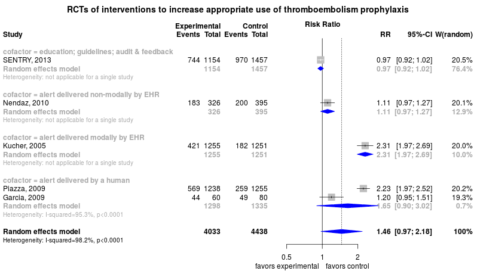

Venous thromboembolism prevention in the hospital
============================================
A living systematic review

**Clinical summary:** This meta-analysis suggests that clinical intervention *is not* effective unless presented the the physician in a modal dialogue box (eg, forcing function) within the electronic health record. Heterogeneity of results as measured by I2 was '[substantial](http://handbook-5-1.cochrane.org/chapter_9/9_5_2_identifying_and_measuring_heterogeneity.htm)' at 98%. This review updates previously published meta-analysis(es).(citation[s] below)

Meta-regression of common modulators (year of publication, study size, event rate in the control groups) finds that the outcome of the intervention is effected by xx.
* [Reconciliation of conclusions with prior meta-analyses](files/reconciliation-tables/Reconciliation%20of%20conclusions.pdf) (under construction)
* [Keep current with this topic](files/searching/Keep-up.md) (under construction)

Acknowledgement: we acknowledge the essential work by the authors of the prior [systematic review(s)](#systematic-reviews) listed below.

**Methods overview:** This repository is an [openMetaAnalysis](https://openmetaanalysis.github.io/) that combines methods of scoping, rapid, and living systematic reviews.  This analysis updates one or more previously published review(s) below. A comparison of studies included in this review compared to prior reviews are in the table, [reconciliation of trials included with prior meta-analyses/](files/reconciliation-tables/Reconciliation%20of%20studies.pdf). Newer studies included are listed in the references below. Rationale for newer trials excluded may be listed at the end of the references. 
* [Methods](http://openmetaanalysis.github.io/methods.html) for openMetaAnalysis
* [Evidence search](files/searching/evidence-search.md) for this review (under construction)

**Results:** Details of the studies included are in the:
* [Reconciliation of trials included with prior meta-analyses/](files/reconciliation-tables/Reconciliation%20of%20studies.pdf) (under construction)
* [Description of studies (PICO table)](files/study-details/table-pico.pdf) (under construction)
* [Risk of bias assessment](files/study-details/table-bias.pdf) (under construction)
* [Forest plots](../master/files/forest-plots) ([source data](files/data))
* [Network plots](../master/files/network) (optional)
* [Reconciliation of conclusions with prior meta-analyses](files/reconciliation-tables/Reconciliation%20of%20conclusions.pdf) (under construction)

The forest plot for the primary outcomes are below. Additional [forest plots](files/forest-plots) of secondary analyses may be available. 

<!--
The meta-regression for the primary outcomes are below. Additional [meta-regressions](files/metaregression) of secondary analyses may be available. 

The GRADE Profile is below. 
-->

References:
----------------------------------

### Systematic review(s)
#### Most recent review at time of last revision of this repository

### Randomized controlled trials
#### New trial(s) *not* included in the most recent review above
1. Duff J, Omari A, Middleton S, McInnes E, Walker K. Educational outreach visits to improve venous thromboembolism prevention in  hospitalised medical patients: a prospective before-and-after intervention study. BMC Health Serv Res. 2013 Oct 8;13:398. PMCID: [PMC3852069](http://pubmed.gov/PMC3852069)
2. Durieux P, Nizard R, Ravaud P, Mounier N, Lepage E. A clinical decision support system for prevention of venous thromboembolism: effect  on physician behavior. JAMA. United States; 2000 Jun 7;283(21):2816–2821. PMID: [10838650](http://pubmed.gov/10838650)
3. Garcia DA, Highfill J, Finnerty K, Varoz E, McConkey S, Hutchinson K, Libby E. A prospective, controlled trial of a pharmacy-driven alert system to increase  thromboprophylaxis rates in medical inpatients. Blood Coagul Fibrinolysis. England; 2009 Oct;20(7):541–545. PMID: [19584716](http://pubmed.gov/19584716)
4. Kucher N, Koo S, Quiroz R, Cooper JM, Paterno MD, Soukonnikov B, Goldhaber SZ. Electronic alerts to prevent venous thromboembolism among hospitalized patients. N Engl J Med. United States; 2005 Mar 10;352(10):969–977. PMID: 15758007
5. Lecumberri R, Marqués M, Díaz-Navarlaz MT, Panizo E, Toledo J, García-Mouriz A, Páramo JA. Maintained effectiveness of an electronic alert system to prevent venous  thromboembolism among hospitalized patients. Thromb Haemost. Germany; 2008 Oct;100(4):699–704. PMID: [18841295](http://pubmed.gov/18841295)
6. Nendaz MR, Chopard P, Lovis C, Kucher N, Asmis LM, Dörffler J, Spirk D, Bounameaux H. Adequacy of venous thromboprophylaxis in acutely ill medical patients (IMPART):  multisite comparison of different clinical decision support systems. J Thromb Haemost. England; 2010 Jun;8(6):1230–1234. PMID: [20175871](http://pubmed.gov/20175871)
7. Pai M, Lloyd NS, Cheng J, Thabane L, Spencer FA, Cook DJ, Haynes RB, Schünemann HJ, Douketis JD. Strategies to enhance venous thromboprophylaxis in hospitalized medical patients  (SENTRY): a pilot cluster randomized trial. Implement Sci. 2013 Jan 2;8:1. PMCID: [PMC3547806](http://pubmed.gov/PMC3547806)
8. Piazza G, Rosenbaum EJ, Pendergast W, Jacobson JO, Pendleton RC, McLaren GD, Elliott CG, Stevens SM, Patton WF, Dabbagh O, Paterno MD, Catapane E, Li Z, Goldhaber SZ. Physician alerts to prevent symptomatic venous thromboembolism in hospitalized  patients. Circulation. 2009 Apr 28;119(16):2196–2201. PMCID: [PMC2901546](http://pubmed.gov/PMC2901546)

#### Trial(s) included in the review above

#### Trial(s) undergoing review
None

#### Trial(s) excluded - selected list of important trial(s)

#### Cited by
This repository is cited by:

1. WikiDoc contributors. Pending content page. WikiDoc. Nov 9, 2014. Available at: http://www.wikidoc.org/index.php/This_topic. Accessed November 9, 2014. 

-------------------------------
[Cite and use this content](https://github.com/openMetaAnalysis/openMetaAnalysis.github.io/blob/master/reusing.MD)  - [Edit this page](../../edit/master/README.md) - [License](files/LICENSE.md) - [History](../../commits/master/README.md)  - 
[Issues and comments](../../issues?q=is%3Aboth+is%3Aissue)

